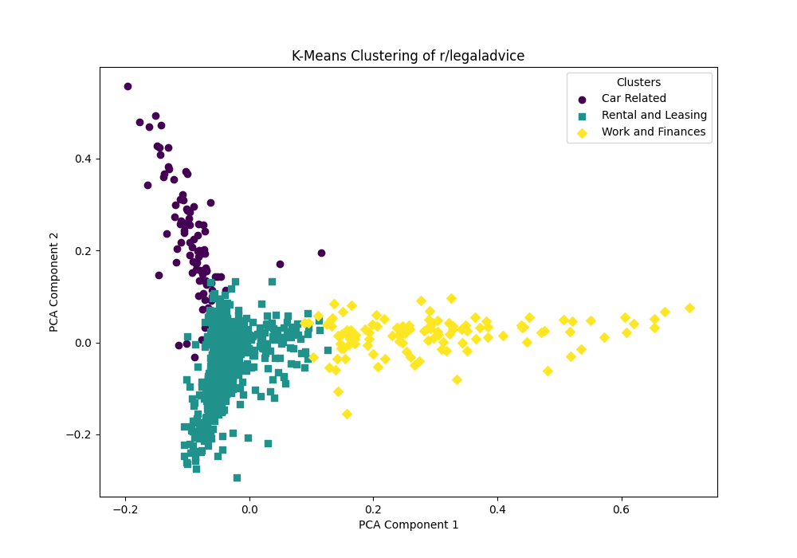

# r-legaladvice-text-analytics-project

## Overview

This project analyzes posts from the **r/legaladvice** subreddit to uncover common legal trends and issues. By focusing on the most recent 1000 hot posts, we aim to capture the most current legal topics being discussed. Unlike other approaches that look at all-time top posts, this analysis prioritizes fresh, real-time content to identify what’s currently relevant.

## Objective

The goal is to identify common legal themes in **r/legaladvice** by:

- Grouping posts based on shared topics.
- Applying text analysis techniques to uncover patterns in the content.

## Data Collection

The data for this project was pulled using the **Reddit API**, specifically focusing on the **top 1000 hot posts** in the **r/legaladvice** subreddit. We looked at both the titles and the body of each post, excluding comments for simplicity. This ensures that the analysis remains focused on the main content of user submissions.

Each time the code runs, it fetches the most recent hot posts, allowing us to continuously track new topics as they trend.

## Data Preprocessing

### Text Standardization:
To prepare the data, the text was standardized by:
- Removing punctuation.
- Converting everything to lowercase.
- Applying other formatting adjustments to ensure consistency.
We also removed common stopwords like "the", "I", and "and". After examining the initial clustering results, we manually added additional stopwords, such as common terms that were redundant in the context of the legal topics.

### TF-IDF Transformation:
Next, we applied a **TF-IDF (Term Frequency-Inverse Document Frequency)** transformation to the data. This step converted the text into numerical features, highlighting the most important terms in the posts.

## Clustering and Analysis

### K-Means Clustering:
We tested different cluster numbers (ranging from 3 to 7) to find the best way to group posts. The number of clusters was chosen based on a balance of relevance and interpretability in the context of legal issues.

### PCA (Principal Component Analysis):
To visualize the clusters, we used **PCA** to reduce the data’s dimensions. This helped us map the posts into a 2D space, making it easier to spot patterns and groupings.

### Ranking Clusters:
Once the posts were clustered, we ranked the clusters based on the **average TF-IDF score** for the terms in each cluster. This gave us a sense of which clusters were most important based on word relevance.

## Results and Visualizations

We visualized the clustering results using PCA, with each cluster represented in 2D. Based on the key terms in each cluster, we manually labeled them:

- **Cluster 0: Lease and Rental**  
  Score = 0.6076  
  Key terms: lease, rent, landlord, apartment, tenant  

- **Cluster 2: Car and Insurance**  
  Score = 0.5678  
  Key terms: car, insurance, accident, title, driver  

- **Cluster 1: Work and Finances**  
  Score = 0.1184  
  Key terms: work, house, home, money, job  

### Sample Visualization:
Here’s a visualization of the clustering results:

- Each point represents a post in the 2D PCA space.
- Posts with similar content are grouped together and color-coded for clarity.

## Conclusion

This project offers a snapshot of the legal issues trending in **r/legaladvice** right now. By clustering posts based on their content, we can see which topics are currently being discussed most. The rankings based on TF-IDF score help highlight the most relevant clusters, providing a clear picture of the legal issues that are dominating the conversation at this moment.

